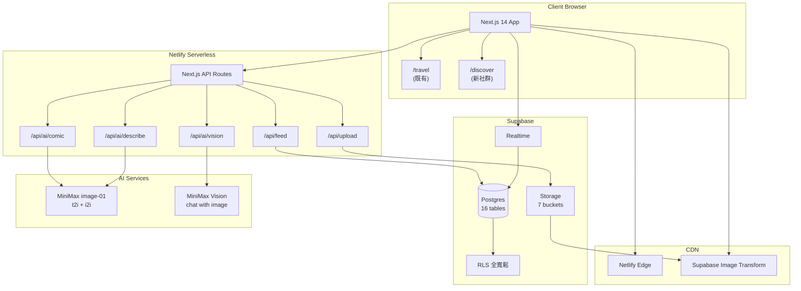
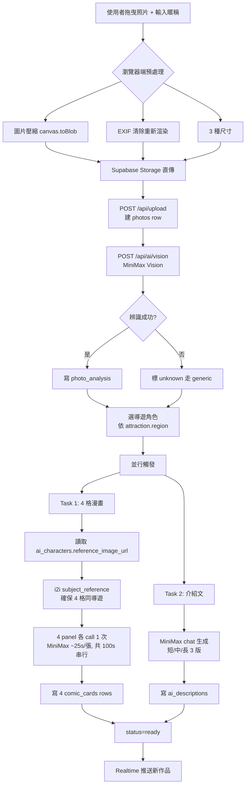
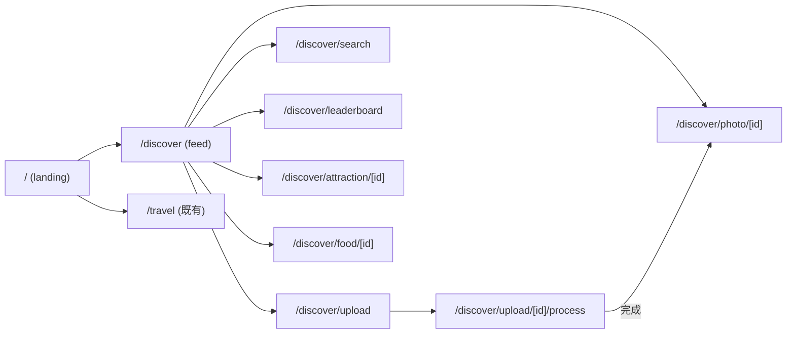

# AI 旅遊漫畫圖鑑社群平台 — 設計文件 v2.0

**版本**：v2.0（重構版）· 2026-06-03
**狀態**：🟡 設計階段，禁止開始實作
**作者**：Hermes

---

## 📋 v1.0 → v2.0 變更摘要

| 變更 | v1.0 | v2.0 | 原因 |
|---|---|---|---|
| **會員系統** | Supabase Auth（email + OAuth） | **完全不做會員**（純 anon） | user 明確要求「所有來我這裡想做就可以做！不要限制」 |
| **profiles 表** | 17 表含 profiles | **刪除**，改用 `author_name` 純文字欄位 | 不做會員就不需要 user profile |
| **Auth endpoints** | 5 個 auth/* endpoints | **全部移除** | 同上 |
| **RLS 政策** | 部分 user-only | **全部 `using (true)` 寬鬆** | 純 anon 開放 |
| **i2i 參數** | 假設 image/image_url | **`subject_reference` (character only)** | 讀 MiniMax OpenAPI spec 後修正 |
| **時光機策略** | img2img 風格轉換 | **t2i prompt 改寫**（i2i 限制：只支援人物） | 同上 |
| **i2i 真正用途** | 風格轉換 | **4 格漫畫角色一致性**（同一導遊 4 格） | 同上 |
| **MVP 時間表** | W1-D3 串 Supabase Auth | 改為 W1-D3 實作 `author_name` localStorage 機制 | 不做會員 |

---

## 0. 文件目的與審核重點

本文檔是「AI 旅遊漫畫圖鑑社群平台」的完整設計文件，涵蓋 9 項交付物：

1. ✅ 系統架構圖
2. ✅ 資料庫 ER Diagram
3. ✅ Supabase Schema（**16 表**，原 17 表刪 profiles）
4. ✅ API 規劃（**20 endpoints**，原 25+ 移除 auth/*）
5. ✅ AI Workflow
6. ✅ 頁面流程圖
7. ✅ 權限設計（**全寬鬆 RLS**）
8. ✅ Storage 規劃
9. ✅ MVP 開發計畫（**4 週**）
10. ✅ Production Deployment Plan

> **審核者請特別看第 0.2 節「設計假設」與第 12 節「開放問題」**

---

## 0.1 專案定位

### 與現有專案的關係

| 現有模組 | 用途 | 與新平台的關係 |
|---|---|---|
| `/travel` | 個人/小團 杭州 trip 共編工具 | **不動** |
| `/characters` (Manga Studio) | 漫劇角色生成 | **借鑑** |
| `/discover`（新） | **全球旅遊 AI 漫畫圖鑑社群** | **本次新建** |

### 核心定位

- **不取代**現有 `/travel`
- **是獨立新模組** `/discover`，共享同一 Supabase 專案
- **完全開放**（不做會員、不設上傳限制）— 來就能做
- 定位：**全球旅遊景點 + 美食的 AI 漫畫圖鑑社群**

---

## 0.2 設計假設（v2.0 修正版，需 user 確認）

### A. 技術棧

| # | 假設 | v2.0 修正 |
|---|---|---|
| A1 | 沿用現有 Supabase 專案 | 沿用 |
| A2 | **AI = 純 MiniMax**（image-01 + MiniMax vision）| ✅ user 確認 |
| A3 | 部署維持 Netlify | 沿用 |
| A4 | Next.js 14 App Router | 沿用 |
| A5 | 後端 = Next.js API routes | 沿用 |
| A6 | v1 純網頁、v1.1 加 PWA | 沿用 |
| A7 | **i2i 透過 `subject_reference`，僅支援 `character` 類型** | 從 MiniMax OpenAPI spec 確認 |

### B. 功能範圍

| # | 假設 | v2.0 修正 |
|---|---|---|
| B1 | MVP = 4 模組（上傳/辨識/漫畫/圖集） | 沿用 |
| **B2** | ~~完整 Supabase Auth~~ → **完全不做會員，純 anon** | ✅ user 要求 |
| B3 | 圖片壓縮瀏覽器端（canvas.toBlob） | 沿用 |
| B4 | EXIF 清除 = 瀏覽器端 | 沿用 |
| B5 | 4 格漫畫 = 4 張獨立 AI 生圖 + 拼版 | 沿用（**v2.0 加**：可用 i2i subject_reference 確保角色一致）|
| B6 | 時光機 / 美食地圖 / 角色選擇 = v1.1+ | 沿用 |
| B7 | Dark Mode = v1.1+ | 沿用 |
| B8 | i18n = v1 純繁中 | 沿用 |
| **B9** | **不設任何上傳 / 互動 / 使用限制** | ✅ user 要求「不要限制」 |
| **B10** | **`author_name` 純文字，不綁帳號**（localStorage 記「我的暱稱」）| v2.0 新增 |

### C. 內容政策

| # | 假設 |
|---|---|
| C1 | 公開上傳 = 公開瀏覽（無 private）|
| C2 | 軟刪除（status='deleted'）|
| C3 | **不做管理員審核**（v1 全開放，v1.1+ 視需要加）|
| C4 | AI 生成內容標 `is_ai_generated=true`（透明）|
| C5 | i2i 限制：只支援人物肖像一致性，**時光機改用 t2i prompt 改寫** |

---

## 0.3 MVP 範圍

4 個核心模組，4 週可上線：

| 模組 | 工時 | 優先級 |
|---|---|---|
| M1. 照片上傳 + author_name | 3 天 | P0 |
| M2. AI 景點 + 美食辨識 | 4 天 | P0 |
| M3. AI 4 格漫畫（**i2i 角色一致性**）| 5 天 | P0 |
| M4. 公開圖集 + 單張頁 | 3 天 | P0 |

v1.1+ 延後：M5-M12（角色切換 UI、時光機、互動、搜尋、排行榜、Dark mode、PWA、i18n）

---

## 1. 系統架構圖



**v2.0 關鍵差異**：移除 Supabase Auth 區塊（純 anon）。

---

## 2. 資料庫 ER Diagram

```mermaid
erDiagram
  photos ||--|| photo_analysis : has_one
  photos ||--o{ comic_cards : produces
  photos ||--|| ai_descriptions : has_one
  photos ||--o{ likes : receives
  photos ||--o{ comments : receives
  photos ||--o{ favorites : saved_as
  photos ||--o{ shares : shared_as
  photos ||--o{ reports : reported_as
  photos }o--o| galleries : belongs_to
  photos }o--o| attractions : identifies
  photos }o--o{ foods : tags
  photos }o--o| ai_characters : uses

  attractions ||--o{ foods : nearby
  attractions ||--o{ photos : identified_in

  galleries ||--o{ photos : contains

  ai_characters ||--o{ photos : features

  comments ||--o{ comments : replies_to

  leaderboards }o--|| photos : ranks

  photos {
    uuid id PK
    text author_name "純文字暱稱，無帳號"
    text title
    text caption
    text original_url
    text compressed_url
    text thumbnail_url
    text exif_country
    text exif_city
    numeric exif_lat
    numeric exif_lng
    text status
    int width
    int height
    int file_size
    int like_count
    int comment_count
    int view_count
    int share_count
    boolean is_ai_generated
    timestamptz created_at
    timestamptz updated_at
  }

  comments {
    uuid id PK
    uuid photo_id FK
    text author_name "純文字"
    uuid parent_id FK
    text content
    int like_count
    text status
    timestamptz created_at
  }

  likes {
    uuid id PK
    text user_fingerprint "localStorage UUID, 純前端識別"
    uuid photo_id FK
    text target_type
    timestamptz created_at
  }
  -- (其餘表相同，略)
```

**v2.0 關鍵改動**：
- ❌ 刪除 `profiles` 表（不做會員）
- ✅ `photos.author_name text` 取代 `uploader_id uuid`
- ✅ `comments.author_name text` 取代 `author_id uuid`
- ✅ `likes.user_fingerprint text` 取代 `user_id uuid`（純前端 localStorage 識別「我按過」）

---

## 3. Supabase Schema（v2.0 — 16 表，全寬鬆 RLS）

完整 SQL — **需在 Supabase SQL Editor 跑**：

```sql
-- ============================================================
-- AI 旅遊漫畫圖鑑社群平台 Schema v2.0
-- 純 anon · 16 tables · 全寬鬆 RLS
-- Run in Supabase SQL Editor
-- 2026-06-03
-- ============================================================

create extension if not exists "uuid-ossp";

-- ============================================================
-- 1. galleries（圖集 — 公開精選/主題精選）
-- ============================================================
create table if not exists public.galleries (
  id              uuid primary key default uuid_generate_v4(),
  name            text not null,
  description     text default '',
  cover_photo_id  uuid,
  visibility      text default 'public' check (visibility in ('public','unlisted')),
  sort_order      int default 0,
  photo_count     int default 0,
  created_at      timestamptz default now()
);

-- ============================================================
-- 2. photos（照片主表）
-- ============================================================
create table if not exists public.photos (
  id               uuid primary key default uuid_generate_v4(),
  author_name      text not null default '匿名旅人',
  gallery_id       uuid references public.galleries(id) on delete set null,
  title            text not null,
  caption          text default '',
  original_url     text not null,
  compressed_url   text not null,
  thumbnail_url    text not null,
  exif_country     text,
  exif_city        text,
  exif_lat         numeric(9,6),
  exif_lng         numeric(9,6),
  status           text default 'processing' check (status in ('processing','ready','failed','deleted')),
  width            int,
  height           int,
  file_size        int,
  like_count       int default 0,
  comment_count    int default 0,
  view_count       int default 0,
  share_count      int default 0,
  is_ai_generated  boolean default false,
  created_at       timestamptz default now(),
  updated_at       timestamptz default now()
);

-- ============================================================
-- 3. photo_analysis（AI 辨識結果）
-- ============================================================
create table if not exists public.photo_analysis (
  id                 uuid primary key default uuid_generate_v4(),
  photo_id           uuid unique not null references public.photos(id) on delete cascade,
  attraction_name    text,
  country            text,
  city               text,
  region             text,
  building_type      text,
  historical_context text,
  cultural_features  text,
  tags               text[] default '{}',
  confidence         numeric(3,2) check (confidence between 0 and 1),
  raw_ai_response    jsonb,
  created_at         timestamptz default now()
);

-- ============================================================
-- 4. attractions（全球景點主檔）
-- ============================================================
create table if not exists public.attractions (
  id            uuid primary key default uuid_generate_v4(),
  name          text unique not null,
  name_en       text,
  country       text,
  city          text,
  region        text,
  building_type text,
  description   text,
  lat           numeric(9,6),
  lng           numeric(9,6),
  tags          text[] default '{}',
  photo_count   int default 0,
  created_at    timestamptz default now()
);

-- ============================================================
-- 5. foods（全球美食主檔）
-- ============================================================
create table if not exists public.foods (
  id               uuid primary key default uuid_generate_v4(),
  name             text unique not null,
  country          text,
  region           text,
  category         text check (category in ('snack','main','drink','dessert')),
  description      text,
  recommendation   text,
  score            numeric(2,1) check (score between 0 and 5),
  target_audience  text,
  tags             text[] default '{}',
  photo_count      int default 0,
  created_at       timestamptz default now()
);

-- ============================================================
-- 6. ai_characters（8 個導遊角色）
-- ============================================================
create table if not exists public.ai_characters (
  id                 uuid primary key default uuid_generate_v4(),
  name               text unique not null,
  name_en            text,
  region             text check (region in ('taiwan','japan','korea','europe','history','cute','qstyle','abugi')),
  description        text,
  avatar_url         text,
  -- i2i 用：把這個角色圖塞 subject_reference 確保 4 格漫畫同一人
  reference_image_url text,
  -- t2i 用：prompt 片段
  style_prompt       text not null,
  suitable_for_tags  text[] default '{}',
  is_active          boolean default true,
  usage_count        int default 0,
  created_at         timestamptz default now()
);

-- ============================================================
-- 7. comic_cards（4 格漫畫）
-- ============================================================
create table if not exists public.comic_cards (
  id                   uuid primary key default uuid_generate_v4(),
  photo_id             uuid not null references public.photos(id) on delete cascade,
  panel_index          int not null check (panel_index between 1 and 4),
  panel_title          text not null,
  panel_caption        text not null,
  image_url            text,
  aspect_ratio         text default '4:5' check (aspect_ratio in ('1:1','4:5','16:9')),
  generation_attempts  int default 0,
  status               text default 'generating' check (status in ('generating','ready','failed')),
  created_at           timestamptz default now(),
  unique(photo_id, panel_index)
);

-- ============================================================
-- 8. ai_descriptions（短/中/長介紹文）
-- ============================================================
create table if not exists public.ai_descriptions (
  id            uuid primary key default uuid_generate_v4(),
  photo_id      uuid unique not null references public.photos(id) on delete cascade,
  short_100     text,
  medium_300    text,
  long_800      text,
  style         text default 'humor' check (style in ('humor','family','pro_guide','influencer','comic_narration','abugi')),
  language      text default 'zh-TW',
  created_at    timestamptz default now()
);

-- ============================================================
-- 9. comments（純 anon 留言）
-- ============================================================
create table if not exists public.comments (
  id            uuid primary key default uuid_generate_v4(),
  photo_id      uuid not null references public.photos(id) on delete cascade,
  author_name   text not null default '匿名旅人',
  parent_id     uuid references public.comments(id) on delete cascade,
  content       text not null check (length(content) between 1 and 1000),
  like_count    int default 0,
  status        text default 'visible' check (status in ('visible','hidden','deleted')),
  created_at    timestamptz default now()
);

-- ============================================================
-- 10. likes（純前端指紋識別）
-- ============================================================
create table if not exists public.likes (
  id           uuid primary key default uuid_generate_v4(),
  user_fingerprint text not null,  -- localStorage UUID，純前端識別「我」
  photo_id     uuid references public.photos(id) on delete cascade,
  comment_id   uuid references public.comments(id) on delete cascade,
  target_type  text not null check (target_type in ('photo','comment')),
  created_at   timestamptz default now(),
  unique(user_fingerprint, photo_id, target_type)
);

-- ============================================================
-- 11. favorites
-- ============================================================
create table if not exists public.favorites (
  id              uuid primary key default uuid_generate_v4(),
  user_fingerprint text not null,
  photo_id        uuid not null references public.photos(id) on delete cascade,
  collection_name text default 'default',
  created_at      timestamptz default now(),
  unique(user_fingerprint, photo_id, collection_name)
);

-- ============================================================
-- 12. shares
-- ============================================================
create table if not exists public.shares (
  id          uuid primary key default uuid_generate_v4(),
  user_fingerprint text not null,
  photo_id    uuid not null references public.photos(id) on delete cascade,
  platform    text not null check (platform in ('instagram','facebook','threads','xhs','youtube','other')),
  share_url   text,
  created_at  timestamptz default now()
);

-- ============================================================
-- 13. reports（純 anon 檢舉 — v2.0 暫不隱藏，僅記錄）
-- ============================================================
create table if not exists public.reports (
  id              uuid primary key default uuid_generate_v4(),
  reporter_fingerprint text not null,
  photo_id        uuid not null references public.photos(id) on delete cascade,
  reason          text not null check (reason in ('spam','inappropriate','copyright','other')),
  description     text,
  created_at      timestamptz default now()
);

-- ============================================================
-- 14. leaderboards
-- ============================================================
create table if not exists public.leaderboards (
  id            uuid primary key default uuid_generate_v4(),
  period        text not null check (period in ('daily','weekly','monthly')),
  period_start  date not null,
  scope         text default 'global' check (scope in ('global','country','city')),
  scope_value   text,
  photo_id      uuid not null references public.photos(id) on delete cascade,
  rank          int not null,
  score         int not null,
  sort_by       text not null check (sort_by in ('views','likes','favorites','shares','comments')),
  created_at    timestamptz default now(),
  unique(period, period_start, scope, scope_value, sort_by, photo_id)
);

-- 物化視圖：每日 top
create or replace view public.v_daily_top as
  select photo_id, sum(like_count + comment_count*2 + share_count*3) as score
  from public.photos
  where status = 'ready' and created_at > now() - interval '1 day'
  group by photo_id
  order by score desc
  limit 100;

-- ============================================================
-- 15. activity_logs
-- ============================================================
create table if not exists public.activity_logs (
  id              uuid primary key default uuid_generate_v4(),
  user_fingerprint text not null,
  action          text not null check (action in ('upload','like','favorite','comment','share','view')),
  target_id       uuid,
  target_type     text,
  metadata        jsonb default '{}',
  created_at      timestamptz default now()
);

-- ============================================================
-- 16. notifications（站內通知，全站廣播，純 anon）
-- ============================================================
create table if not exists public.notifications (
  id           uuid primary key default uuid_generate_v4(),
  type         text not null check (type in ('system','featured')),
  content      text not null,
  related_id   uuid,
  created_at   timestamptz default now()
);

-- ============================================================
-- Indexes
-- ============================================================
create index idx_photos_created on public.photos(created_at desc) where status = 'ready';
create index idx_photos_status on public.photos(status);
create index idx_photos_gallery on public.photos(gallery_id);
create index idx_photo_analysis_photo on public.photo_analysis(photo_id);
create index idx_attractions_country_city on public.attractions(country, city);
create index idx_attractions_tags on public.attractions using gin(tags);
create index idx_foods_tags on public.foods using gin(tags);
create index idx_foods_category on public.foods(category);
create index idx_comic_photo on public.comic_cards(photo_id);
create index idx_comments_photo on public.comments(photo_id, created_at desc);
create index idx_likes_photo on public.likes(photo_id);
create index idx_likes_user on public.likes(user_fingerprint);
create index idx_favorites_user on public.favorites(user_fingerprint, created_at desc);
create index idx_shares_photo on public.shares(photo_id, created_at desc);
create index idx_leaderboards_period on public.leaderboards(period, period_start desc, sort_by, rank);
create index idx_activity_target on public.activity_logs(target_id, target_type);
create index idx_activity_time on public.activity_logs(created_at desc);

-- Full Text Search
alter table public.photos add column fts tsvector
  generated always as (
    to_tsvector('simple',
      coalesce(title,'') || ' ' ||
      coalesce(caption,'') || ' ' ||
      coalesce(author_name,'') || ' ' ||
      coalesce(exif_country,'') || ' ' ||
      coalesce(exif_city,'')
    )
  ) stored;
create index idx_photos_fts on public.photos using gin(fts);

-- ============================================================
-- RLS — 全寬鬆（純 anon 開放）
-- ============================================================
alter table public.photos enable row level security;
create policy "公開讀 ready 照片" on public.photos for select using (status = 'ready' or status = 'processing');
create policy "公開寫照片" on public.photos for insert with check (true);
create policy "公開改照片" on public.photos for update using (true);
create policy "公開刪照片" on public.photos for delete using (true);

alter table public.photo_analysis enable row level security;
create policy "公開讀 analysis" on public.photo_analysis for select using (true);
create policy "公開寫 analysis" on public.photo_analysis for insert with check (true);

alter table public.comic_cards enable row level security;
create policy "公開讀 comics" on public.comic_cards for select using (true);
create policy "公開寫 comics" on public.comic_cards for insert with check (true);
create policy "公開改 comics" on public.comic_cards for update using (true);

alter table public.ai_descriptions enable row level security;
create policy "公開讀 desc" on public.ai_descriptions for select using (true);
create policy "公開寫 desc" on public.ai_descriptions for insert with check (true);

alter table public.attractions enable row level security;
create policy "公開讀 attractions" on public.attractions for select using (true);
create policy "公開寫 attractions" on public.attractions for insert with check (true);
create policy "公開改 attractions" on public.attractions for update using (true);

alter table public.foods enable row level security;
create policy "公開讀 foods" on public.foods for select using (true);
create policy "公開寫 foods" on public.foods for insert with check (true);
create policy "公開改 foods" on public.foods for update using (true);

alter table public.ai_characters enable row level security;
create policy "公開讀 characters" on public.ai_characters for select using (is_active = true);
create policy "公開寫 characters" on public.ai_characters for insert with check (true);
create policy "公開改 characters" on public.ai_characters for update using (true);

alter table public.comments enable row level security;
create policy "公開讀 comments" on public.comments for select using (status != 'deleted');
create policy "公開寫 comments" on public.comments for insert with check (true);
create policy "公開改 comments" on public.comments for update using (true);

alter table public.likes enable row level security;
create policy "公開讀 likes" on public.likes for select using (true);
create policy "公開寫 likes" on public.likes for insert with check (true);
create policy "公開刪 likes" on public.likes for delete using (true);

alter table public.favorites enable row level security;
create policy "公開讀 favorites" on public.favorites for select using (true);
create policy "公開寫 favorites" on public.favorites for insert with check (true);
create policy "公開刪 favorites" on public.favorites for delete using (true);

alter table public.shares enable row level security;
create policy "公開讀 shares" on public.shares for select using (true);
create policy "公開寫 shares" on public.shares for insert with check (true);

alter table public.reports enable row level security;
create policy "公開寫 reports" on public.reports for insert with check (true);

alter table public.leaderboards enable row level security;
create policy "公開讀 leaderboards" on public.leaderboards for select using (true);
create policy "公開寫 leaderboards" on public.leaderboards for insert with check (true);

alter table public.activity_logs enable row level security;
create policy "公開寫 activity" on public.activity_logs for insert with check (true);

alter table public.notifications enable row level security;
create policy "公開讀 notifications" on public.notifications for select using (true);
create policy "公開寫 notifications" on public.notifications for insert with check (true);

alter table public.galleries enable row level security;
create policy "公開讀 galleries" on public.galleries for select using (true);
create policy "公開寫 galleries" on public.galleries for insert with check (true);
create policy "公開改 galleries" on public.galleries for update using (true);
```

---

## 4. AI Workflow（v2.0 — MiniMax 完整能力）

### 4.1 MiniMax Image API 完整能力

從 OpenAPI spec 確認（`POST /v1/image_generation`）：

| 參數 | 必填 | 說明 |
|---|---|---|
| `model` | ✓ | `image-01` 或 `image-01-live` |
| `prompt` | ✓ | 最多 1500 字 |
| `subject_reference` |  | **i2i 用**，array，每個元素 `{type:"character", image_file:url}` |
| `aspect_ratio` |  | 1:1, 16:9, 4:3, 3:2, 2:3, 3:4, 9:16, 21:9 |
| `width/height` |  | 512-2048, 8 的倍數（image-01 only） |
| `response_format` |  | `url`（24h 過期）或 `base64` |
| `seed` |  | 可重現 |
| `n` |  | 1-9 張 |
| `prompt_optimizer` |  | 是否自動優化 prompt |

**v2.0 關鍵調整**：
- ✅ **4 格漫畫用 i2i**：上傳導遊 reference_image，`subject_reference: [{type:"character", image_file: ref}]` 確保 4 格同一個導遊
- ⚠️ **時光機 v1.1+ 用 t2i + prompt 改寫**（i2i 限制只支援 character，不適合做「同景點不同時代」）

### 4.2 完整流程圖



### 4.3 失敗重試 / 速率

| 失敗類型 | 重試 | 退避 |
|---|---|---|
| Storage 上傳 | 3 | 1s, 3s, 9s |
| Vision API | 3 | 2s, 6s, 18s |
| Comic 4 panel | 每 panel 2 次 | 5s, 15s |
| MiniMax rate limit | 全域 25/min | 串行而非並行（4 panel 各 25s 共 100s）|

### 4.4 8 個導遊角色 — v2.0 含 reference_image

```sql
insert into public.ai_characters (name, region, description, reference_image_url, style_prompt, suitable_for_tags) values
('阿布吉', 'abugi',
  '搞笑台式導遊，愛講冷笑話但很實用',
  '/characters/abugi.png',
  'a friendly chubby cartoon tour guide with sunglasses, baseball cap, holding a flag, exaggerated expressions, vibrant colors, manga style, chibi proportions',
  array['taiwan','temple','nightmarket','street']),

('台灣導遊', 'taiwan',
  '熱情的台灣女孩，詳細解說在地文化',
  '/characters/taiwan-guide.png',
  'a young Taiwanese female tour guide, long hair, casual outfit, warm smile, holding a clipboard, watercolor style, soft pastel colors',
  array['taiwan','culture','history','food']),

('日本導遊', 'japan',
  '優雅的京都藝伎，細膩介紹寺廟與祭典',
  '/characters/japan-guide.png',
  'a graceful Japanese guide in elegant kimono, traditional hairstyle, serene expression, ukiyo-e meets modern anime style, soft pinks and golds',
  array['japan','temple','cherry','traditional']),

('韓國導遊', 'korea',
  '時尚首爾女生，推薦潮流景點與美食',
  '/characters/korea-guide.png',
  'a trendy K-pop inspired Korean guide, colorful hair, modern streetwear, cute pose, kawaii style, neon accents',
  array['korea','modern','cafe','kpop']),

('歐洲導遊', 'europe',
  '古典歐洲紳士，深度講解建築歷史',
  '/characters/europe-guide.png',
  'a distinguished European gentleman with monocle, top hat, tweed jacket, holding an old map, vintage storybook illustration style, warm sepia tones',
  array['europe','castle','cathedral','museum']),

('歷史人物', 'history',
  '根據景點自動切換：孔子/拿破崙/蘇軾等',
  '/characters/historical.png',
  'a wise historical figure in period-appropriate clothing, classical oil painting meets manga style',
  array['history','ancient','classical','heritage']),

('可愛動物', 'cute',
  '吉祥物風格：貓熊/柴犬/貓咪任選',
  '/characters/cute-animal.png',
  'an adorable mascot character wearing a tiny tour guide uniform, big sparkly eyes, super kawaii, soft rounded shapes',
  array['cute','family','kids','zoo']),

('Q版漫畫', 'qstyle',
  '純 Q版漫畫風，最通用預設',
  '/characters/qstyle.png',
  'chibi super-deformed style, 2-3 head-tall proportions, big eyes, simple lines, bright flat colors, minimal background, clean lineart',
  array['any','default','versatile']);
```

**reference_image_url 要先繪製**（用 MiniMax t2i 生成 8 張角色 reference）— 這 8 張是上線前必備素材。

### 4.5 4 格漫畫 i2i 範例

```javascript
// lib/ai/comic.ts
async function generateComicPanel(opts: {
  characterRefUrl: string;       // /characters/abugi.png
  panelIndex: 1|2|3|4;
  scene: string;
  caption: string;
}) {
  const prompt = buildPanelPrompt(opts);   // 見下
  return fetch('https://api.minimax.io/v1/image_generation', {
    method: 'POST',
    headers: {
      'Authorization': `Bearer ${process.env.MINIMAX_API_KEY}`,
      'Content-Type': 'application/json'
    },
    body: JSON.stringify({
      model: 'image-01',
      prompt,
      aspect_ratio: '4:5',
      n: 1,
      response_format: 'base64',
      // i2i: 角色一致性
      subject_reference: [{
        type: 'character',
        image_file: opts.characterRefUrl
      }]
    })
  });
}

function buildPanelPrompt({ panelIndex, scene, caption }: PanelOpts): string {
  const base = process.env.NEXT_PUBLIC_CHARACTER_STYLE_PROMPT || '';
  const captions = [
    `Panel 1: ${base} waving at the entrance of ${scene}, speech bubble "${caption}"`,
    `Panel 2: ${base} explaining the history of ${scene}, sepia background, "${caption}"`,
    `Panel 3: ${base} tasting ${scene}'s famous food, "${caption}"`,
    `Panel 4: ${base} doing selfie pose at ${scene}, golden hour, "${caption}"`,
  ];
  return captions[panelIndex - 1];
}
```

### 4.6 時光機（v1.1+，已修正策略）

**v1.0 規劃**：img2img 風格轉換
**v2.0 修正**：i2i 限制只支援 character，**改用 t2i prompt 改寫**

```javascript
// lib/ai/timeMachine.ts — v1.1+
const TIME_MACHINE_STYLES = {
  ancient:    "Tang dynasty painting style, ink wash, ancient clothing, calligraphy overlay",
  "100yr_ago": "1920s sepia photograph, vintage car, period fashion, no color",
  showa:      "1950s Japanese Showa era, hand-tinted colors, post-war architecture",
  early_roc:  "1930s Republic of China, qipao, rickshaw, Shanghai Bund morning",
  future_2050: "futuristic 2050, flying vehicles, holographic signs, neon accents",
  cyberpunk:  "cyberpunk 2077 style, neon rain, megacorp logos, dark city night",
  rpg_map:    "top-down RPG world map style, parchment, quest markers, fantasy frame",
  anime:      "Studio Ghibli anime style, soft watercolor, magical atmosphere"
};

async function timeMachine(photoUrl: string, style: keyof typeof TIME_MACHINE_STYLES) {
  // 純 t2i — prompt 描述「同一個景點 + 新風格」
  // ⚠️ 不保留原圖輪廓，景點相似度靠 prompt 描述
  return fetch(API, {
    method: 'POST',
    body: JSON.stringify({
      model: 'image-01',
      prompt: `${styleDesc}, depicting ${originalAttractionPrompt}`,
      aspect_ratio: '4:5',
      n: 1,
      response_format: 'base64'
    })
  });
}
```

**時光機的限制**（要在 UI 提示使用者）：
- 純 t2i 不保留原圖輪廓 — 結果是「同景點不同時代的詮釋」，不是「風格轉換」
- 對建築/風景效果有限（描述限制）
- 對人物照效果較好（服裝/風格明顯）

### 4.7 介紹文生成（v2.0 不變）

```
短版 100 字 / 中版 300 字 / 長版 800 字
風格：humor / family / pro_guide / influencer / comic_narration / abugi
```

---

## 5. API 規劃（v2.0 — 20 endpoints，移除 auth/*）

| Method | Path | 說明 |
|---|---|---|
| **Upload** | | |
| POST | `/api/upload/signed-url` | 取得 Supabase Storage signed URL（直傳） |
| POST | `/api/upload/complete` | 上傳完成，trigger AI |
| **Photos** | | |
| GET | `/api/photos` | 公開圖集 feed（分頁）|
| GET | `/api/photos/[id]` | 單張 + 漫畫 + 介紹文 |
| GET | `/api/photos/[id]/related` | 同景點/同美食相關作品 |
| PATCH | `/api/photos/[id]` | 編輯（純文字 author_name 驗證） |
| DELETE | `/api/photos/[id]` | 軟刪除 |
| POST | `/api/photos/[id]/view` | view_count++ |
| **AI** | | |
| POST | `/api/ai/vision` | 景點/美食辨識 |
| POST | `/api/ai/comic` | 4 格漫畫生成（**i2i subject_reference 角色一致**）|
| POST | `/api/ai/describe` | 介紹文生成 |
| POST | `/api/ai/regenerate-panel` | 重生單格 |
| POST | `/api/ai/time-machine` | v1.1+ 時光機（t2i） |
| **Social** | | |
| POST | `/api/photos/[id]/like` | 按讚（純前端 fingerprint） |
| POST | `/api/photos/[id]/favorite` | 收藏 |
| POST | `/api/photos/[id]/share` | 分享 |
| POST | `/api/photos/[id]/report` | 檢舉 |
| GET | `/api/photos/[id]/comments` | 留言 |
| POST | `/api/photos/[id]/comments` | 留言 |
| **Search & Discover** | | |
| GET | `/api/search?q=...` | 全文搜尋 |
| GET | `/api/attractions` | 景點列表 |
| GET | `/api/foods` | 美食列表 |
| GET | `/api/characters` | 導遊角色 |
| **Leaderboard** | | |
| GET | `/api/leaderboard?period=...` | 排行榜 |

**v2.0 移除**：
- ❌ `/api/auth/signup`
- ❌ `/api/auth/login`
- ❌ `/api/auth/logout`
- ❌ `/api/auth/me`
- ❌ `/api/users/me`
- ❌ `/api/users/[username]`

---

## 6. 頁面流程圖（v2.0 — 無登入）



**v2.0 移除頁面**：
- ❌ `/auth/login`
- ❌ `/auth/signup`
- ❌ `/discover/settings`
- ❌ `/discover/user/[username]`

---

## 7. 權限設計（v2.0 — 全開放）

### 7.1 角色矩陣

| 動作 | 任何訪客 | 自己上傳的 |
|---|---|---|
| 瀏覽照片 | ✓ | ✓ |
| 上傳照片 | ✓ | ✓ |
| 編輯自己照片 | – | ✓ |
| 刪除自己照片 | – | ✓ |
| 按讚/收藏/留言/檢舉 | ✓ | ✓ |

### 7.2 識別機制

**完全不做帳號系統**。所有「我是誰」用：

- **作者名稱**：純文字 `author_name`，寫入 photos/comments
- **按讚/收藏指紋**：localStorage UUID `user_fingerprint`（純前端）
  - 自己看到的「我按過了」狀態 = localStorage 查
  - 公開按讚數 = DB count
  - 別人看不到是誰按的

### 7.3 為什麼不做會員（依 user 要求）

- 「所有來我這裡想做就可以做！不要限制」
- 降低摩擦
- 純內容平台（不像 SNS 需追蹤關係）
- 防濫用靠檢舉 + 軟刪除（v1 暫不做自動隱藏）

---

## 8. Storage 規劃（v2.0 — 7 buckets，無 RLS 限制）

### 8.1 Buckets

| Bucket | 公開 | 大小限制 | 路徑約定 | 用途 |
|---|---|---|---|---|
| `discover-originals` | 否 | 20MB | `{photo_id}/original.{ext}` | 原始上傳（不對外） |
| `discover-compressed` | 是 | 2MB | `{photo_id}/compressed.jpg` | 公開顯示 |
| `discover-thumbnails` | 是 | 50KB | `{photo_id}/thumb.jpg` | 列表小圖 |
| `discover-cartoons` | 是 | 1MB | `{photo_id}/panel_{1-4}.jpg` | 4 格漫畫 |
| `discover-time-machine` | 是 | 2MB | `{photo_id}/time_{style}.jpg` | 時光機 v1.1+ |
| `discover-character-refs` | 是 | 500KB | `{character_id}.png` | 導遊 reference |
| `discover-galleries` | 是 | 200KB | `{gallery_id}.jpg` | 圖集封面 |

### 8.2 Bucket 政策（全部寬鬆）

```sql
-- 寫入由 Server Function 處理（用 service_role）
-- 公開讀（除了 originals）
create policy "公開讀公開 buckets" on storage.objects for select to public
  using (bucket_id in (
    'discover-compressed','discover-thumbnails','discover-cartoons',
    'discover-time-machine','discover-character-refs','discover-galleries'
  ));

create policy "公開讀自己的 originals" on storage.objects for select to public
  using (bucket_id = 'discover-originals');  -- 全公開讀（沒 user 概念）
```

### 8.3 圖片處理策略

不變：瀏覽器端壓縮/縮圖/EXIF清除（0 Server 成本）

---

## 9. MVP 開發計畫（4 週，v2.0 調整）

| 週 | 天 | 任務 | 交付 |
|---|---|---|---|
| **W1** | D1 | 1. Schema 跑版（16 表 + 7 buckets + 全寬鬆 RLS） | SQL 檔可執行 |
| | D2 | 2. `author_name` 機制（localStorage 純前端） | 首次訪問彈輸入框 |
| | D3 | 3. 8 個導遊角色 reference 圖（用 MiniMax t2i 生 8 張） | `discover-character-refs` 8 張 |
| | D4-D5 | 4. 照片上傳模組（瀏覽器壓縮、EXIF 清除、3 種尺寸） | `/discover/upload` |
| **W2** | D6-D8 | 5. AI Vision 景點 + 美食辨識 | `/api/ai/vision` |
| | D9-D10 | 6. AI 4 格漫畫（含 i2i subject_reference） | `/api/ai/comic` |
| **W3** | D11-D12 | 7. AI 介紹文生成（短/中/長 3 版） | `/api/ai/describe` |
| | D13 | 8. 公開圖集 feed（masonry + infinite scroll） | `/discover` |
| | D14-D15 | 9. 單張照片頁（漫畫 + 介紹文 + 留言） | `/discover/photo/[id]` |
| **W4** | D16 | 10. 按讚/收藏/留言（純前端指紋） | social icons |
| | D17 | 11. 響應式 + 行動裝置調校 | 全部頁面 |
| | D18 | 12. E2E 測試 + 部署 Netlify Production | 公開上線 |

**v2.0 vs v1.0 差異**：
- ❌ 不做 Supabase Auth（省 0.5 天）
- ✅ 加 8 個 reference 圖前置作業（D3）
- ✅ 加社交按讚/留言（D16 取代原計畫不做）

---

## 10. Production Deployment Plan（v2.0）

### 10.1 環境變數

```bash
# Supabase
NEXT_PUBLIC_SUPABASE_URL=
NEXT_PUBLIC_SUPABASE_PUBLISHABLE_KEY=
SUPABASE_SERVICE_ROLE_KEY=        # Server only

# AI
MINIMAX_API_KEY=                  # Server only
```

**v2.0 移除**：
- ❌ GOOGLE_CLIENT_ID
- ❌ GOOGLE_CLIENT_SECRET
- ❌ Supabase Auth 設定

### 10.2 Deployment checklist（v2.0）

- [ ] Schema 跑版
- [ ] 7 buckets 建立
- [ ] 8 個 character reference 圖上傳
- [ ] Netlify env vars 設定（無 OAuth）
- [ ] Supabase Realtime publication 加新表
- [ ] E2E 測試
- [ ] Lighthouse ≥ 80
- [ ] Mobile 實機測試

---

## 11. Storage 路徑約定對照表

| 用途 | v1.0 path | v2.0 path |
|---|---|---|
| 上傳 | `travel-originals/{user_id}/...` | `discover-originals/{photo_id}/...` |
| 顯示 | `travel-compressed/{user_id}/...` | `discover-compressed/{photo_id}/...` |
| 漫畫 | `travel-cartoons/{photo_id}/...` | `discover-cartoons/{photo_id}/...` |
| 角色 | `travel-avatars/{name}.png` | `discover-character-refs/{id}.png` |

**bucket 名稱從 `travel-*` 改為 `discover-*`** — 避免和現有 /travel 的 photo bucket 混淆。

---

## 12. 開放問題（v2.0 — 需 user 確認）

### 12.1 技術決策

1. **A1 沿用現有 Supabase**？ — 我假設是
2. **A2 純 MiniMax**？ — ✅ user 確認
3. **A3 部署維持 Netlify**？ — 我假設是
4. **A7 i2i 限制**：subject_reference 僅 character 類型 — **時光機改用 t2i**，這個策略 OK 嗎？

### 12.2 範圍

5. **MVP 4 模組 OK 嗎**？
6. **bucket 名稱 `discover-*`** 而非 `travel-*`？避免和現有 /travel 衝突
7. **不做管理員後台**？v1 純開放，v1.1+ 再加？

### 12.3 識別

8. **author_name 機制**：使用者首次訪問彈輸入框，localStorage 記住，之後可改 — OK 嗎？
9. **按讚/收藏用 localStorage 指紋**：使用者從前端知道自己按過，但**換瀏覽器/換裝置就重來** — 接受嗎？（如果接受登入可以解決，但不做會員就不行）
10. **不防 spam**：純 anon 開放可能被洗，按讚/留言氾濫。**接受這個風險**嗎？或者加**極簡的 rate limit**（同 IP 1 分鐘 10 次上傳）？

### 12.4 平台命名

11. **平台名稱**？我目前用 `/discover` 路徑 + 「AI 旅遊漫畫圖鑑」placeholder。要正式命名嗎？（例如「漫遊圖鑑 MangaTrip」）

### 12.5 圖片

12. **單張最大 20MB**？還是放寬到 50MB？4K HEIC 用戶會超過 20MB
13. **單次最多 20 張**？還是「不限制張數，只限單檔大小」？

---

## 13. 文件審核清單

- [ ] 0.2 假設（A1-A7, B1-B10, C1-C5）
- [ ] 1 系統架構圖
- [ ] 2 ER Diagram（16 表，無 profiles）
- [ ] 3 Schema（全寬鬆 RLS）
- [ ] 4 AI Workflow（i2i 角色一致性 + t2i 時光機）
- [ ] 5 API（20 endpoints，無 auth/*）
- [ ] 6 頁面流程（無登入頁）
- [ ] 7 權限（全開放 + 指紋識別）
- [ ] 8 Storage（7 discover-* buckets）
- [ ] 9 MVP 4 週計畫
- [ ] 10 Deployment（無 OAuth env）
- [ ] 12 開放問題回覆

**全部確認後**，再請我進入實作。

---

**文件結束** · v2.0 · 2026-06-03
